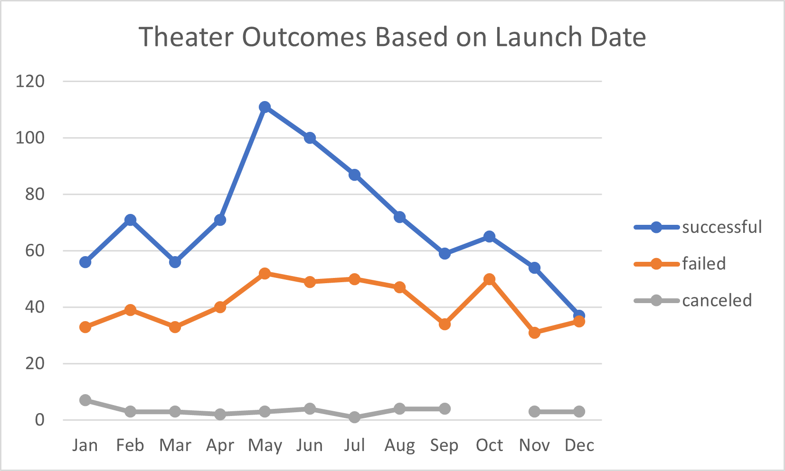
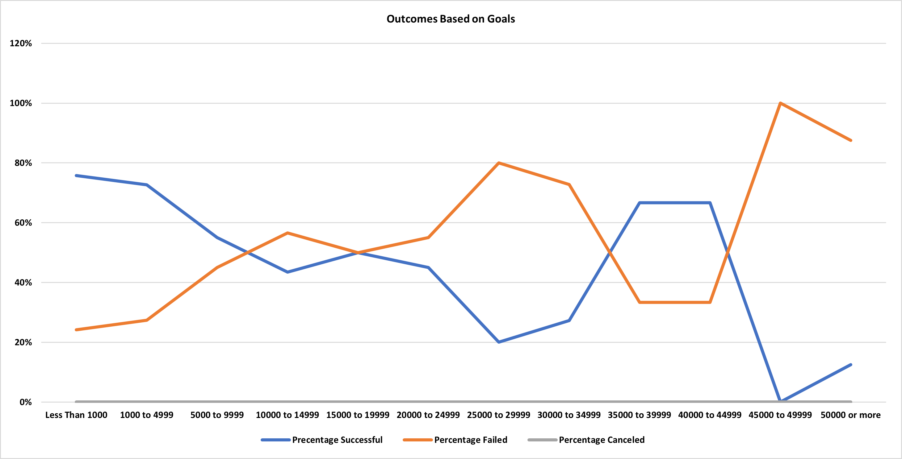

# Kickstarter_Analysis
Performing an analysis on Kickstarter data to uncover trends in Theater/Play crowdfunding
# Kickstarting with Excel

## Overview of Project
The purpose of this analysis was to sort and analyze crowdfunding data for a client who is looking to launch a Kickstarter of their own. They wanted insights on other successful campaigns to set theirs up for the same positive outcome.  

### Purpose

## Analysis and Challenges

### Analysis of Outcomes Based on Launch Date

When analyzing similar theater projects in her country, it was evident that a higher number of successful theater events occurred with a launch date in May. The number of overall successful theater fundraisers follows a downward trend after June and ends up becoming close in number of failed fundraising campaigns in December. 

### Analysis of Outcomes Based on Goals

Once a campaign Goal increases a certain amount then the percentage of failed campaigns beats out the successful ones. If the goal is to simply have a successful campaign amongst all others then it would be best to stay below the $10,000 range.

### Challenges and Difficulties Encountered
There were difficulties in creating the ‘Outcomes Based on Launch Date’ overall pivot table to show the number of successful, failed, and canceled theater events by Month due to those fields were automatically added based off Excel’s anticipated analysis. It was difficult recreating the pivot table a second time in order to trigger Excel’s automatic addition of ‘Quarters’ and ‘Years2’. 
There was also a challenge in ensuring that my nested formulas were consistent with the ‘Outcomes Based on Goals’ table. Once I locked the appropriate criteria ranges the process went more smoothly.  

## Results

- What are two conclusions you can draw about the Outcomes based on Launch Date?
As weather starts to become warmer in the United States, crowd funding for ‘successful’ theater projects increases and stays above a consistent number of ‘failed’ theater projects. During summer months into winter, crowd funding for theater projects shows a downward trend until it reaches the same as the number of failed theater projects. This could be due to some of these theater projects taking place outdoors and therefore requiring funding prior to summer months. 

- What can you conclude about the Outcomes based on Goals?
Louise’s budget request of $10,000 has a higher chance of ‘Failure’ than ‘Success’ based upon the percent of plays failing at the 10,000 to 15,000 level. If she were to decrease her requested budget she will have a potenailly higher percent chance of having a ‘successful’ campaign.  

- What are some limitations of this dataset?
The dataset contains so much additional stats that does not pertain to Louise’s inquiry and would need to be removed. On the opposite end there is potential to further categorize Plays by blurb/type (comedy, tragedy, etc.) to see if the actual type of play itself was a factor in its success or lack thereof. 

- What are some other possible tables and/or graphs that we could create?
Other tables to create would be to look at the number of backers and the amount of dollars pledged over the goal. It would be interesting to see if a higher number of individual backers or a backers paying a higher amount contributed to the overall greater dollar amount of pledges. It would also be interesting to graph trends in theater versus other forms of visual entertainment over the years to gain and idea of the current theater landscape. 

